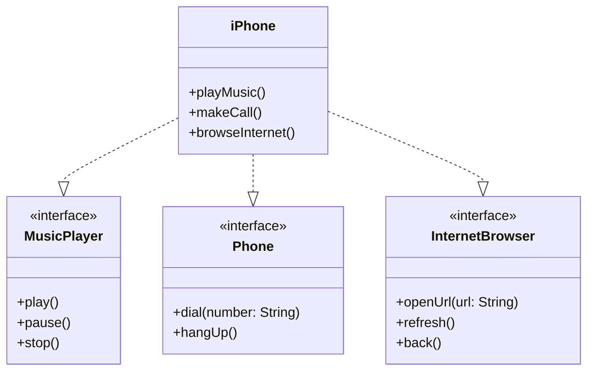

# basico-mermaid

```mermaid
classDiagram
    class iPhone {
        +playMusic()
        +makeCall()
        +browseInternet()
    }

    class MusicPlayer {
        <<interface>>
        +play()
        +pause()
        +stop()
    }

    class Phone {
        <<interface>>
        +dial(number: String)
        +hangUp()
    }

    class InternetBrowser {
        <<interface>>
        +openUrl(url: String)
        +refresh()
        +back()
    }

    iPhone ..|> MusicPlayer
    iPhone ..|> Phone
    iPhone ..|> InternetBrowser
```
