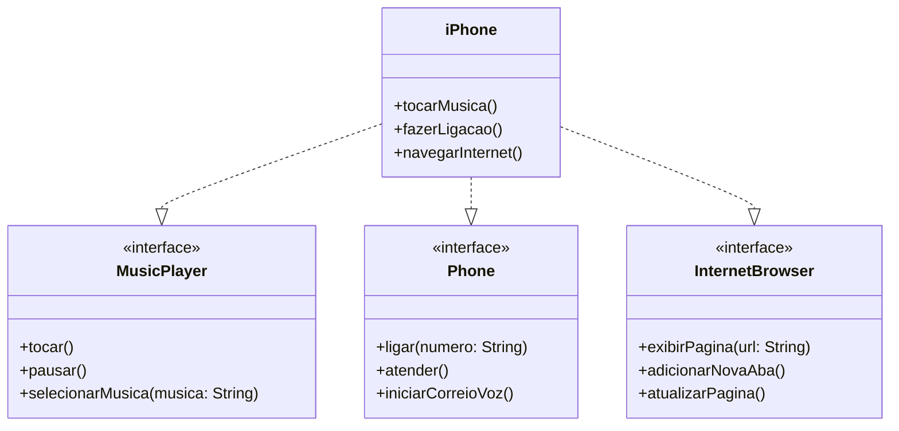

# basico-mermaid

```mermaid
classDiagram
    class iPhone {
        +tocarMusica()
        +fazerLigacao()
        +navegarInternet()
    }

    class MusicPlayer {
        <<interface>>
        +tocar()
        +pausar()
        +selecionarMusica(musica: String)
    }

    class Phone {
        <<interface>>
        +ligar(numero: String)
        +atender()
        +iniciarCorreioVoz()
    }

    class InternetBrowser {
        <<interface>>
        +exibirPagina(url: String)
        +adicionarNovaAba()
        +atualizarPagina()
    }

    iPhone ..|> MusicPlayer
    iPhone ..|> Phone
    iPhone ..|> InternetBrowser
```
